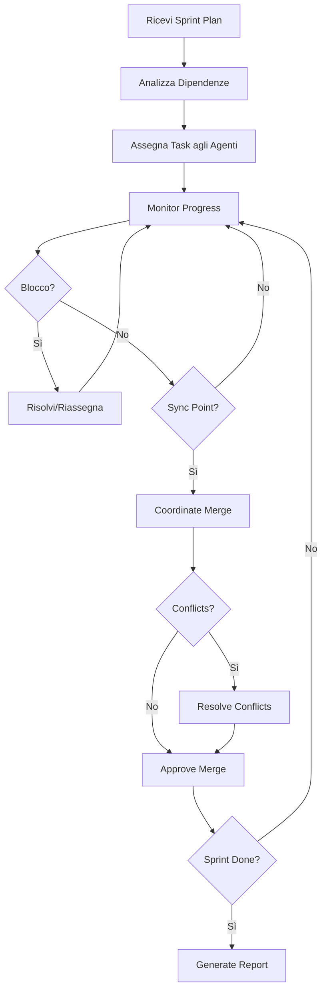

# AG0 - Orchestrator MasterMind

## 🎯 Ruolo
**Orchestratore Parallelo** - Coordina tutti gli agenti, gestisce sincronizzazioni, risolve conflitti e monitora avanzamento sprint.

## 🔧 Responsabilità

### Coordinamento
- Assegna task agli agenti specializzati (AG1-AG6)
- Monitora avanzamento in tempo reale
- Identifica blocchi e dipendenze
- Gestisce code di priorità

### Sincronizzazione
- Pianifica sync points tra track paralleli
- Verifica compatibilità modifiche cross-track
- Gestisce merge conflicts preventivamente
- Mantiene consistency tra moduli

### Quality Gate
- Verifica output di ogni agente
- Esegue validation pre-merge
- Coordina code review automatiche
- Approva o rigetta modifiche

## 📊 Metriche Tracciate
- **Velocity**: Task completati/ora per agente
- **Blocking**: Task bloccati e relative dipendenze
- **Coverage**: % codebase modificata in parallelo
- **Conflicts**: Numero conflitti rilevati/risolti

## 🔄 Workflow



## 🚀 Comandi Disponibili

### Gestione Sprint
```bash
# Avvia sprint con 6 agenti paralleli
./orchestrator.sh start --agents=6 --sprint=current

# Status real-time di tutti gli agenti
./orchestrator.sh status --verbose

# Forza sincronizzazione immediata
./orchestrator.sh sync --track=all

# Genera report avanzamento
./orchestrator.sh report --format=markdown
```

### Gestione Conflitti
```bash
# Identifica conflitti potenziali
./orchestrator.sh analyze-conflicts

# Risolvi conflitto specifico
./orchestrator.sh resolve --conflict-id=C001 --strategy=merge

# Lista conflitti aperti
./orchestrator.sh conflicts --status=open
```

### Debugging
```bash
# Log dettagliato agente specifico
./orchestrator.sh logs --agent=AG2 --tail=50

# Blocca agente per inspection
./orchestrator.sh pause --agent=AG3

# Riavvia agente con nuovo task
./orchestrator.sh restart --agent=AG4 --task=T015
```

## 📋 Task Orchestrator

### Priorità Task
1. **P0-Critical**: Blocker per altri agenti (API contracts, interfaces)
2. **P1-High**: Feature core con dipendenze minime
3. **P2-Medium**: Miglioramenti e refactoring
4. **P3-Low**: Documentation e testing aggiuntivo

### Assegnazione Dinamica
```javascript
// Esempio logica assegnazione
function assignTask(task, agents) {
  const available = agents.filter(a => a.status === 'idle');
  const best = available.reduce((prev, curr) =>
    curr.velocity > prev.velocity ? curr : prev
  );

  if (task.dependencies.length > 0) {
    // Verifica dipendenze risolte
    const ready = task.dependencies.every(dep =>
      completedTasks.includes(dep)
    );
    if (!ready) return queue.push(task);
  }

  best.assignTask(task);
  logAssignment(task.id, best.id);
}
```

## 🔍 Monitoring Dashboard

### Real-time Stats
```
╔═══════════════════════════════════════════════════════════╗
║  FIUTAMI PARALLEL ORCHESTRATOR - Sprint Current          ║
╠═══════════════════════════════════════════════════════════╣
║  ⏱️  Elapsed: 2h 15m        📊 Progress: 65%              ║
║  ✅ Completed: 13/20        🔄 In Progress: 4             ║
║  ⏳ Pending: 3              ❌ Blocked: 0                 ║
╠═══════════════════════════════════════════════════════════╣
║  AG1 Frontend     ████████████░░░░  75%  [ACTIVE]        ║
║  AG2 Design       ██████████████░░  85%  [ACTIVE]        ║
║  AG3 Figma        ████████░░░░░░░░  55%  [ACTIVE]        ║
║  AG4 i18n         ██████░░░░░░░░░░  45%  [IDLE]          ║
║  AG5 Backend      ██████████████░░  80%  [ACTIVE]        ║
║  AG6 Testing      ██████████░░░░░░  60%  [IDLE]          ║
╠═══════════════════════════════════════════════════════════╣
║  🔥 Hotspots: hero.component.ts (3 agents)               ║
║  ⚠️  Conflicts: 0 detected, 2 resolved                   ║
║  📈 Velocity: 6.5 tasks/hour                             ║
╚═══════════════════════════════════════════════════════════╝
```

## 🎓 Best Practices

### DO ✅
- Assegna task con zero dipendenze in parallelo
- Monitora conflitti file-level in real-time
- Usa sync points ogni 2-3 ore
- Mantieni agents bilanciati (carico uniforme)
- Documenta decisioni di risoluzione conflitti

### DON'T ❌
- Non assegnare task con dipendenze circolari
- Non forzare merge senza validation
- Non sovraccaricare singolo agente (>3 task concorrenti)
- Non ignorare warning di conflitto
- Non fare sync durante task critici

## 📞 Comunicazione Inter-Agent

### Message Protocol
```json
{
  "from": "AG0_orchestrator",
  "to": "AG2_design",
  "type": "task_assignment",
  "priority": "high",
  "task": {
    "id": "T012",
    "description": "Update design tokens from Figma sync",
    "files": ["src/styles/_tokens-figma.scss"],
    "dependencies": ["T008"],
    "estimatedTime": "20min"
  },
  "metadata": {
    "timestamp": "2025-11-20T14:30:00Z",
    "sprint": "current",
    "track": "TRACK-B"
  }
}
```

## 🔐 Security & Validation

### Pre-Merge Checks
- ✅ TypeScript compilation success
- ✅ All tests passing (Jasmine + e2e)
- ✅ Lint errors = 0
- ✅ No console.log/debugger statements
- ✅ Accessibility audit passed
- ✅ Bundle size within limits (<500kb)

### Auto-Rollback
Se un merge causa regressioni:
1. Rileva failure (test/build)
2. Auto-revert commit problematico
3. Notifica agente responsabile
4. Riassegna task con fix

## 📈 Performance Optimization

### Parallelization Strategy
- **Max Concurrency**: 6 agenti simultanei
- **Task Granularity**: 15-30min per task
- **Sync Frequency**: Ogni 2 ore o 5 task completati
- **Hot Reload**: Modifiche visible senza restart

### Resource Management
- Ogni agente ha proprio branch temporaneo
- Merge in `develop` solo dopo validation
- CI/CD triggera solo su merge finale
- Artifacts cached per velocizzare rebuild

---

**Status**: ACTIVE
**Version**: 1.0.0
**Last Update**: 2025-11-20
